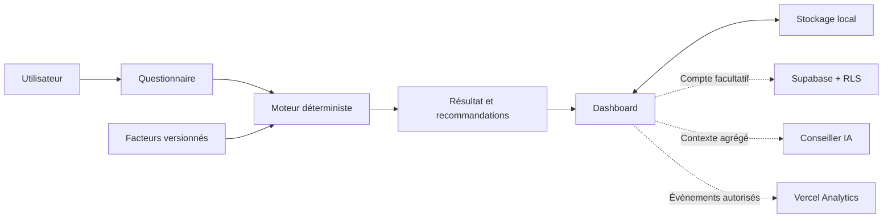

# Architecture de Carbon OS

Carbon OS sépare volontairement le calcul carbone, les données personnelles et les services facultatifs. Le cœur du produit doit rester utilisable sans compte ni backend.

## Vue d’ensemble



Les traits pleins représentent le parcours nécessaire. Les traits pointillés représentent des services facultatifs.

## Frontières du système

### Calcul local

`src/lib/calculator.ts` reçoit des réponses validées et produit un `AssessmentResult`. Pour chaque poste :

```text
activité × facteur d’émission = kg CO₂e
```

Les facteurs vivent dans `src/data/emission-factors.ts`. Chaque facteur précise sa région, son année, sa source, sa date de mise à jour et son niveau de confiance.

### Recommandations

`src/lib/recommendations.ts` recalcule des scénarios déterministes à partir du bilan. Les économies potentielles ne sont pas cumulées mécaniquement : deux actions peuvent agir sur le même poste.

### Persistance locale

`src/lib/history.ts` et `src/lib/action-plan.ts` normalisent les données avant lecture ou écriture. Le navigateur conserve :

- le brouillon du questionnaire ;
- le dernier bilan ;
- l’historique ;
- l’objectif personnel ;
- le plan d’actions.

### Synchronisation facultative

Supabase ajoute l’authentification par lien magique et la synchronisation multi-appareils. Les migrations activent Row Level Security sur toutes les tables utilisateur. Les lectures et écritures ordinaires utilisent la session authentifiée ; la clé serveur n’est utilisée que pour la suppression complète d’un compte.

### Conseiller IA

Le conseiller reçoit un contexte strictement validé : total estimé, niveau de confiance, objectif, catégories agrégées, trois actions maximum et trois recommandations maximum. Il ne reçoit ni l’e-mail, ni l’adresse, ni les réponses détaillées du questionnaire.

### Analytics

`src/lib/analytics.ts` expose une liste fermée d’événements. `src/components/privacy-analytics.tsx` supprime les paramètres d’URL et respecte GPC, DNT et l’opt-out local.

## Structure des routes

| Route               | Rôle                                             |
| ------------------- | ------------------------------------------------ |
| `/`                 | Promesse produit et démarrage                    |
| `/questionnaire`    | Collecte progressive des activités               |
| `/resultat`         | Résultat essentiel et première action            |
| `/dashboard`        | Compréhension, plan et progression               |
| `/compte`           | Authentification et synchronisation facultatives |
| `/methodologie`     | Explication des calculs                          |
| `/confidentialite`  | Politique de confidentialité                     |
| `/mentions-legales` | Identité de l’éditeur                            |

## Invariants à préserver

1. Le calcul essentiel fonctionne sans compte.
2. Les facteurs et calculs restent déterministes et testables.
3. Une donnée personnelle n’entre jamais dans Analytics.
4. Une ligne distante appartient toujours à l’utilisateur authentifié.
5. Le plan actif reste limité à trois actions.
6. Le conseiller IA ne remplace ni le moteur de calcul ni une expertise réglementaire.
